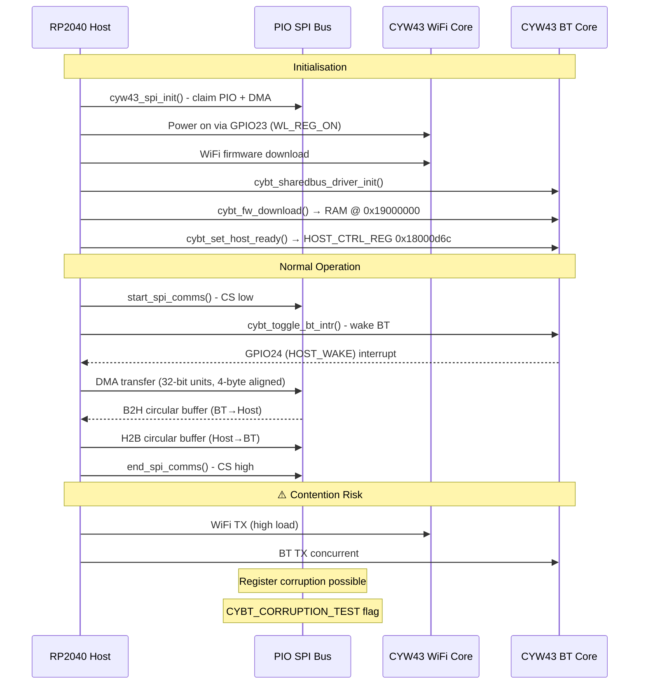
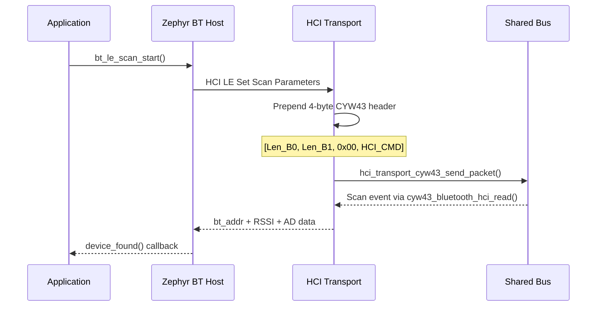
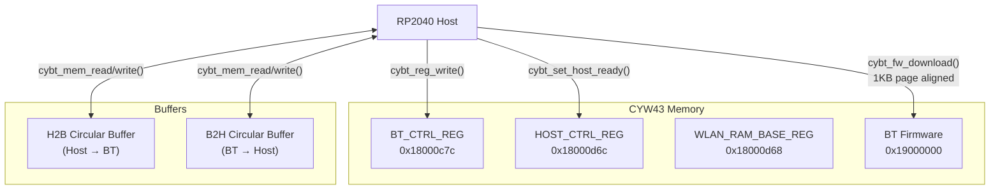

# CYW43 Shared Bus Architecture

The CYW43439 WiFi and Bluetooth cores share a single PIO SPI bus. Understanding this is key to implementing Bluetooth in Zephyr.

## Bus Arbitration

## HCI Packet Flow

## Memory Map

