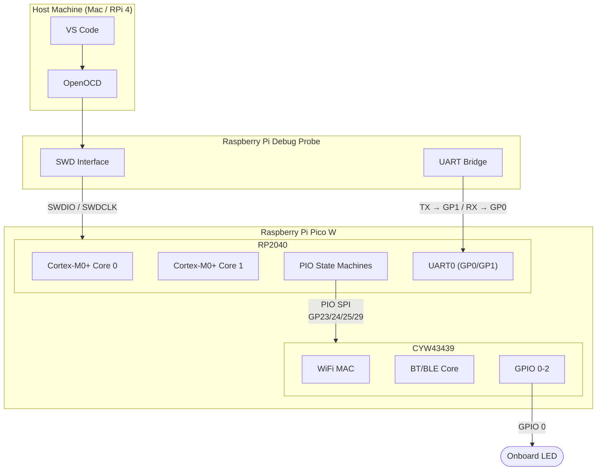
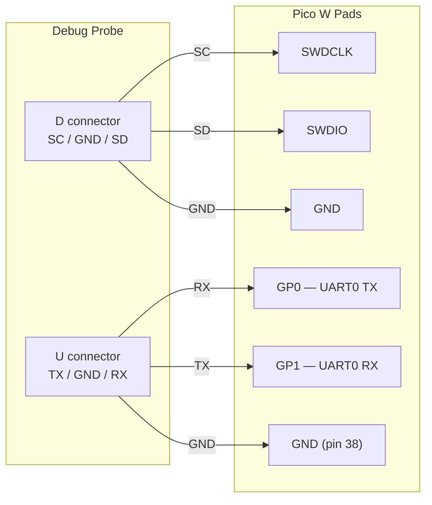
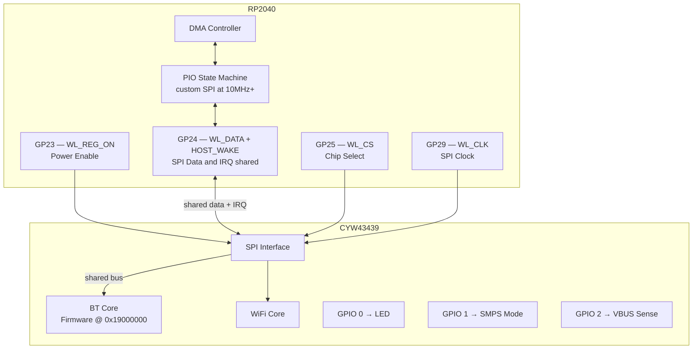

# Hardware Block Diagram

## Pico W System Overview

```mermaid
graph TD
    subgraph HOST["Host Machine (Mac / RPi 4)"]
        VSCODE["VS Code"]
        OPENOCD["OpenOCD"]
    end

    subgraph PROBE["Raspberry Pi Debug Probe"]
        SWD_IF["SWD Interface"]
        UART_IF["UART Bridge"]
    end

    subgraph PICOW["Raspberry Pi Pico W"]
        subgraph RP2040["RP2040"]
            CORE0["Cortex-M0+ Core 0"]
            CORE1["Cortex-M0+ Core 1"]
            PIO["PIO State Machines"]
            UART0["UART0 (GP0/GP1)"]
        end

        subgraph CYW43["CYW43439"]
            WIFI["WiFi MAC"]
            BT["BT/BLE Core"]
            CYW_GPIO["GPIO 0-2"]
        end
    end

    LED(["Onboard LED"])

    VSCODE --> OPENOCD
    OPENOCD --> SWD_IF
    SWD_IF -->|"SWDIO / SWDCLK"| RP2040
    UART_IF -->|"TX → GP1 / RX → GP0"| UART0
    PIO -->|"PIO SPI\nGP23/24/25/29"| CYW43
    CYW_GPIO -->|"GPIO 0"| LED
```

## SWD + UART Connections

```mermaid
graph LR
    subgraph Debug Probe
        D["D connector\nSC / GND / SD"]
        U["U connector\nTX / GND / RX"]
    end

    subgraph Pico W Pads
        SWDCLK["SWDCLK"]
        SWDIO["SWDIO"]
        GND1["GND"]
        GP0["GP0 — UART0 TX"]
        GP1["GP1 — UART0 RX"]
        GND2["GND (pin 38)"]
    end

    D -->|SC| SWDCLK
    D -->|SD| SWDIO
    D -->|GND| GND1
    U -->|TX| GP1
    U -->|RX| GP0
    U -->|GND| GND2
```

## CYW43439 SPI Bus

```mermaid
graph TD
    subgraph RP2040
        PIO_SM["PIO State Machine\ncustom SPI at 10MHz+"]
        DMA["DMA Controller"]
        GP23["GP23 — WL_REG_ON\nPower Enable"]
        GP24["GP24 — WL_DATA + HOST_WAKE\nSPI Data and IRQ shared"]
        GP25["GP25 — WL_CS\nChip Select"]
        GP29["GP29 — WL_CLK\nSPI Clock"]
    end

    subgraph CYW43439
        SPI["SPI Interface"]
        BT_FW["BT Core\nFirmware @ 0x19000000"]
        WIFI_FW["WiFi Core"]
        GPIO0["GPIO 0 → LED"]
        GPIO1["GPIO 1 → SMPS Mode"]
        GPIO2["GPIO 2 → VBUS Sense"]
    end

    GP23 --> SPI
    GP24 <-->|"shared data + IRQ"| SPI
    GP25 --> SPI
    GP29 --> SPI
    DMA <--> PIO_SM
    PIO_SM <--> GP24

    SPI --> WIFI_FW
    SPI -->|"shared bus"| BT_FW
```
