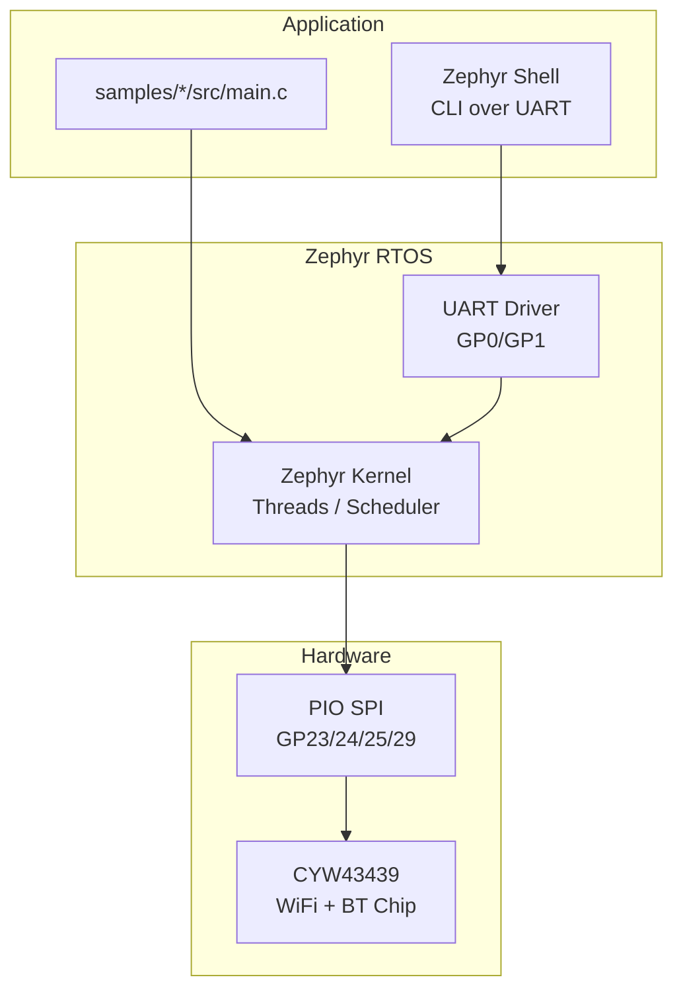
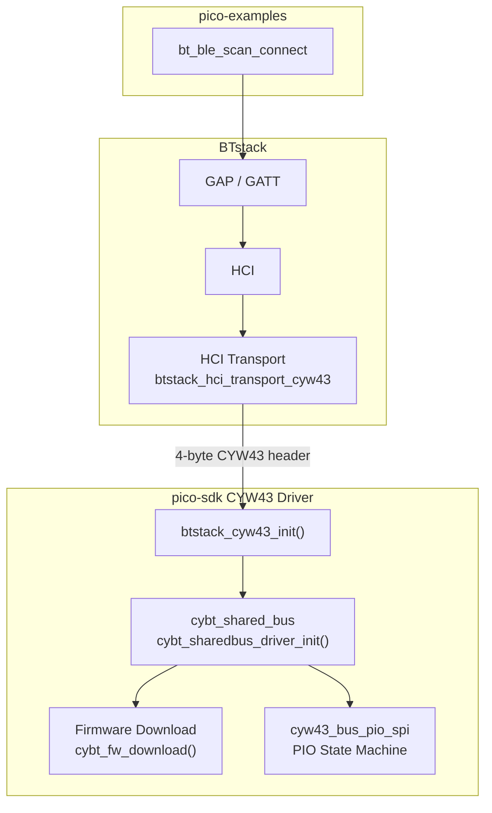

# Software Stack

## Zephyr Stack

```mermaid
graph TD
    subgraph Application
        APP["samples/*/src/main.c"]
        SHELL["Zephyr Shell\nCLI over UART"]
    end

    subgraph Zephyr RTOS
        KERNEL["Zephyr Kernel\nThreads / Scheduler"]
        UART_DRV["UART Driver\nGP0/GP1"]
    end

    subgraph Hardware
        PIO_SPI["PIO SPI\nGP23/24/25/29"]
        CYW43HW["CYW43439\nWiFi + BT Chip"]
    end

    APP --> KERNEL
    SHELL --> UART_DRV
    UART_DRV --> KERNEL
    KERNEL --> PIO_SPI
    PIO_SPI --> CYW43HW
```

## pico-sdk Stack (Reference Implementation)

```mermaid
graph TD
    subgraph pico_examples["pico-examples"]
        BLESCAN["bt_ble_scan_connect"]
    end

    subgraph BTstack
        GAP["GAP / GATT"]
        HCI_BT["HCI"]
        HCI_TRANSPORT_BT["HCI Transport\nbtstack_hci_transport_cyw43"]
    end

    subgraph pico_sdk["pico-sdk CYW43 Driver"]
        CYW43_INIT["btstack_cyw43_init()"]
        SHARED["cybt_shared_bus\ncybt_sharedbus_driver_init()"]
        FW_DL["Firmware Download\ncybt_fw_download()"]
        PIO["cyw43_bus_pio_spi\nPIO State Machine"]
    end

    BLESCAN --> GAP
    GAP --> HCI_BT
    HCI_BT --> HCI_TRANSPORT_BT
    HCI_TRANSPORT_BT -->|"4-byte CYW43 header"| CYW43_INIT
    CYW43_INIT --> SHARED
    SHARED --> FW_DL
    SHARED --> PIO
```
